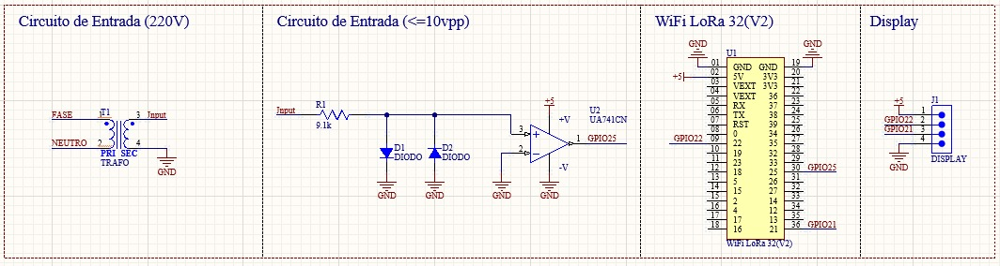

# Frequencímetro ESP32

Este projeto é um frequencímetro desenvolvido para a plataforma ESP32, utilizando o framework ESP-IDF. O objetivo é medir a frequência de sinais digitais aplicados a uma das entradas do microcontrolador e exibir o valor em um display.

## Funcionalidades
- Medição de frequência de sinais digitais conectados ao ESP32.
- Exibição do valor medido em display (ex: LCD I2C ou SSD1306 OLED), facilitando a visualização em tempo real.
- Projeto modular, com componentes separados para leitura de frequência e controle de display, facilitando manutenção e expansão.

<!-- As funcionalidades acima permitem adaptar o projeto para diferentes tipos de sinais e displays, tornando-o versátil para aplicações didáticas e profissionais. -->


## Imagens do Projeto

### Circuito (Diagrama Esquemático)
O diagrama abaixo mostra a ligação dos principais componentes: ESP32, display e entradas de sinal. Útil para montagem e entendimento do funcionamento.


### Montagem do PCB
Foto da placa montada, evidenciando a organização dos componentes e a qualidade da montagem. Ideal para referência visual durante a montagem física.


### Exemplo de Leitura 1
Exemplo de leitura de frequência exibida no display, demonstrando o funcionamento do sistema em operação.


### Exemplo de Leitura 2
Outro exemplo de leitura, mostrando a estabilidade e precisão do frequencímetro em diferentes condições de teste.


<!-- As imagens acima ajudam a ilustrar o funcionamento prático do projeto, desde o planejamento até a execução e testes. -->


## Estrutura do Projeto
- `main/` - Código principal da aplicação, onde está a lógica de inicialização e controle.
- `components/` - Componentes customizados, como drivers de display e leitura de frequência, facilitando a reutilização.
- `build/` - Arquivos gerados durante a compilação (não é necessário versionar).
- `CMakeLists.txt` - Arquivo de configuração do CMake para build do projeto.
- `sdkconfig` - Configurações do projeto ESP-IDF, ajustáveis via menuconfig.

## Componentes Utilizados
- **ESP32**: Microcontrolador principal, responsável pela leitura e processamento dos sinais.
- **Display LCD I2C** ou **SSD1306 OLED**: Para exibição da frequência medida.
- **Componentes customizados**: Localizados em `components/`, facilitam a integração de novos periféricos.

## Como Compilar e Gravar
1. Instale o [ESP-IDF](https://docs.espressif.com/projects/esp-idf/pt/latest/esp32/get-started/), seguindo as instruções oficiais.
2. Clone este repositório para sua máquina local.
3. Configure o ambiente do projeto:
   ```sh
   idf.py set-target esp32   # Define o alvo como ESP32
   idf.py menuconfig         # Ajuste configurações conforme necessário
   ```
4. Compile o projeto:
   ```sh
   idf.py build              # Gera os arquivos binários
   ```
5. Grave no ESP32:
   ```sh
   idf.py -p <PORTA> flash   # Substitua <PORTA> pela porta serial do seu dispositivo
   ```

## Configuração
- As configurações de pinos e parâmetros podem ser ajustadas via `menuconfig` (interface gráfica do ESP-IDF) ou diretamente no código em `main/main.c`.
- Recomenda-se documentar alterações para facilitar futuras manutenções.

## Licença
Este projeto está sob a licença MIT.

<!-- Dúvidas, sugestões ou contribuições são bem-vindas! -->


